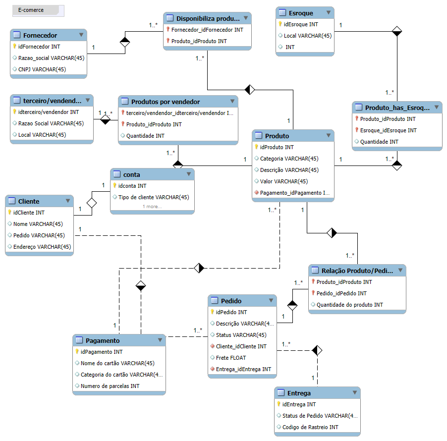

# Modelo de E-commerce com MySQL

Este repositório contém o modelo de entidade-relacionamento para um sistema de E-commerce, criado no MySQL Workbench.

## Diagrama

## Como usar
1. Importe o arquivo `esquema.sql` no MySQL.
2. Consulte o diagrama acima para entender as relações entre as tabelas.
